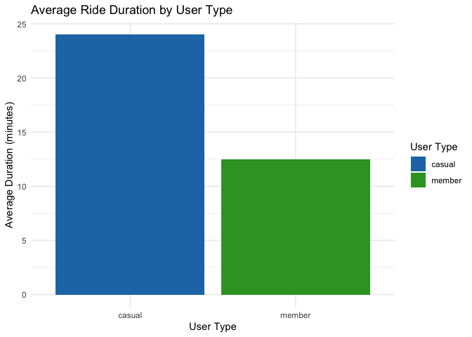
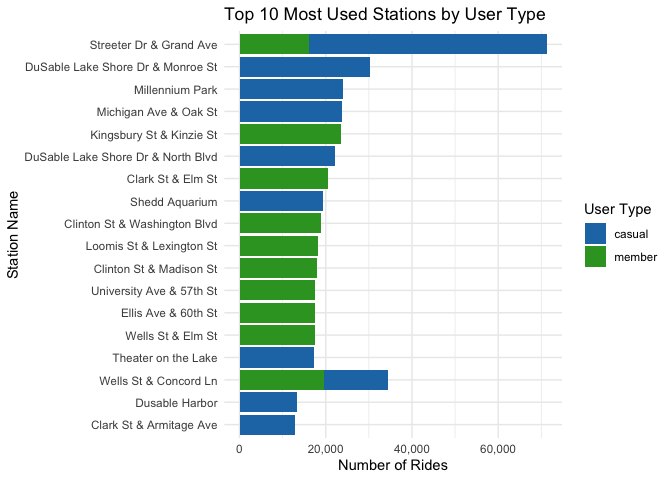
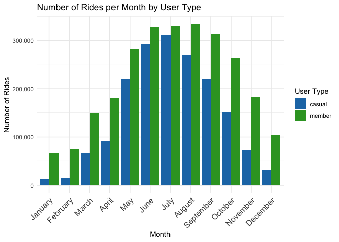
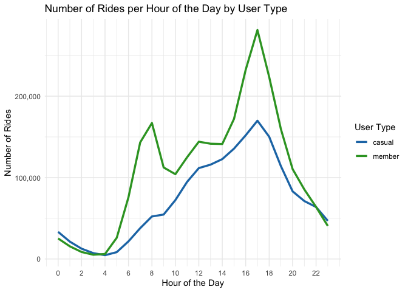

Cyclistic Case of Study
================

## Clear Statement of the Business Task

Analyze Cyclistic’s historical bike trip data to determine how annual
members and casual riders use bikes differently. This includes
evaluating ride patterns such as trip duration, times of usage, and
station preferences. These insights will help the marketing team design
a data-driven strategy to convert casual riders into annual members.

## Data Sources Description

The data for this analysis was obtained from Cyclistic’s historical bike
trip records, provided by Motivate International Inc. The dataset
contains a year’s worth of anonymized information on individual bike
trips taken within Cyclistic’s bike-share program in Chicago. This data
is essential for understanding user behavior, particularly the
differences between casual riders and annual members, to inform future
marketing strategies.

**Data Sources and Location**

- **Data Source**:

Historical trip data was publicly released by Motivate International
Inc. and made available for analysis. The dataset is anonymized,
ensuring no personally identifiable information (PII) is included.

- **Storage Location**:

The data was downloaded and stored in the year folder under the project
directory. Each file represents a specific month, organized in CSV
format.

### Key Variables and Structure

- **Rows**: Each row represents an individual bike trip.

- **Columns**: The dataset includes 13 variables, categorized as
  follows:

- **Trip Information**:

ride_id: Unique identifier for each trip. rideable_type: Type of bike
used (e.g., standard bike, cargo bike). started_at and ended_at:
Timestamps for trip start and end. start_station_name and
end_station_name: Names of starting and ending stations.

- **Geographical Information**: start_lat, start_lng: Latitude and
  longitude of the starting station. end_lat, end_lng: Latitude and
  longitude of the ending station.

- **Rider Type**: member_casual: Indicates if the rider is a casual user
  or an annual member.

### Considerations for Data Integrity and Credibility

The dataset adheres to ROCCC principles:

Reliability: Provided by a trusted source (Motivate International Inc.).
Originality: Represents real-world usage data. Comprehensiveness: Covers
a full year, capturing seasonal trends. Consistency: Uniform schema
across all monthly files. Currency: While historical, the data is recent
enough to provide actionable insights.

Bias Considerations: Limited demographic data restricts deeper
segmentation. Potential overrepresentation of frequent riders or urban
commuters.

**Licensing and Privacy**

Data is publicly available under a license provided by Motivate
International Inc. Personally Identifiable Information has been excluded
to ensure compliance with privacy standards.

### Data Cleaning and Preparation

\-**Data Combination**: Monthly files were combined into a single data
frame (all_trip_data) using the bind_rows() function for a comprehensive
analysis.

Despite these limitations, the dataset provides valuable insights into
Cyclistic users’ riding patterns and can support data-driven marketing
strategies.

\-**Data Cleaning Steps**:

1.  **Data Validation**

1.1 Column data types (chr, dbl, dttm) were verified using glimpse() to
ensure compatibility with the analysis. 1.2 A total of 1,298,134 rows
with missing values were identified using is.na() and colSums(is.na()).
1.3 Missing values in key columns were handled by replacing NA values in
station names with “Unknown Start Station” and “Unknown 1.4 End
Station”, and by using the median for missing coordinates. 0 duplicate
rows were detected and removed, ensuring dataset uniqueness. 1.5 Date
and time formats (started_at, ended_at) were validated to ensure correct
parsing.

2.  **Transforming the Data**

2.1 Ride Duration Calculation: A new column, ride_length, was created by
calculating the difference between ended_at and started_at in minutes
using difftime().

2.2 Filtering Out Invalid Rides: Records where ride_length was less than
or equal to 0 were removed to ensure data validity.

2.3 Day of the Week Calculation: A new column, day_of_week, was created
using wday() to analyze usage trends by the day of the week.

2.4 Ensuring Consistent Data Formats: Validated and corrected data types
(e.g., timestamps were parsed to dttm). Ensured ride durations were
positive by calculating ride_length and filtering out negative values.

## Analysis of Ride Data: Calculations, Trends, and Relationships

1.  **Performing Calculations**

- Ride Duration: The average ride duration is significantly higher for
  casual users (~29 minutes) compared to members (~13 minutes).
- Most Frequent Ride Day: Saturday is the most common day for rides.
- Maximum Ride Length: The longest recorded ride lasted 41,387.25
  minutes (~28 days), likely an outlier.
- Most used stations: It is difficult to draw definitive conclusions due
  to inconsistent data. As mentioned earlier, there were missing values
  in the dataset. Instead of deleting those rows, I decided to fill them
  as “Unknown Start Station” to preserve as much data as possible.

2.  **Identifying Trends and Relationships**

- User Behavior Differences: Casual users tend to have longer ride
  durations than members, suggesting they may use bikes for leisure
  rather than commuting.
- Weekly Trends: Members take more rides on weekdays, particularly
  Tuesday through Thursday, while casual users ride more on weekends,
  with a peak on Saturday.
- Hourly Trends: Members’ rides peak during commuting hours (7-9 AM and
  5-7 PM), indicating work-related use. Casual users ride more steadily
  throughout the day, with a small evening peak.
- Seasonal Patterns: Rides increase from spring, peak in summer (July
  and August), and decline in fall and winter. Casual users’ ridership
  drops significantly in colder months, while members maintain a
  relatively stable pattern.

This is an R Markdown format used for publishing markdown documents to
GitHub. When you click the **Knit** button all R code chunks are run and
a markdown file (.md) suitable for publishing to GitHub is generated.

## Including Code

``` r
# Install necessary packages
library(tidyverse)
```

    ## ── Attaching core tidyverse packages ──────────────────────── tidyverse 2.0.0 ──
    ## ✔ dplyr     1.1.4     ✔ readr     2.1.5
    ## ✔ forcats   1.0.0     ✔ stringr   1.5.1
    ## ✔ ggplot2   3.5.1     ✔ tibble    3.2.1
    ## ✔ lubridate 1.9.4     ✔ tidyr     1.3.1
    ## ✔ purrr     1.0.2     
    ## ── Conflicts ────────────────────────────────────────── tidyverse_conflicts() ──
    ## ✖ dplyr::filter() masks stats::filter()
    ## ✖ dplyr::lag()    masks stats::lag()
    ## ℹ Use the conflicted package (<http://conflicted.r-lib.org/>) to force all conflicts to become errors

``` r
library(lubridate)
library(readxl)
library(conflicted)

# Define the folder path containing CSV files
folder_path <- "/Users/viviana/Documents/CYCLISTIC/year"
csv_files <- list.files(path = folder_path, pattern = "\\.csv$", full.names = TRUE)

# Read all CSV files and store them in a list
trip_data_list <- lapply(csv_files, read_csv)
```

    ## Rows: 371249 Columns: 13
    ## ── Column specification ────────────────────────────────────────────────────────
    ## Delimiter: ","
    ## chr  (7): ride_id, rideable_type, start_station_name, start_station_id, end_...
    ## dbl  (4): start_lat, start_lng, end_lat, end_lng
    ## dttm (2): started_at, ended_at
    ## 
    ## ℹ Use `spec()` to retrieve the full column specification for this data.
    ## ℹ Specify the column types or set `show_col_types = FALSE` to quiet this message.
    ## Rows: 785932 Columns: 13
    ## ── Column specification ────────────────────────────────────────────────────────
    ## Delimiter: ","
    ## chr  (7): ride_id, rideable_type, start_station_name, start_station_id, end_...
    ## dbl  (4): start_lat, start_lng, end_lat, end_lng
    ## dttm (2): started_at, ended_at
    ## 
    ## ℹ Use `spec()` to retrieve the full column specification for this data.
    ## ℹ Specify the column types or set `show_col_types = FALSE` to quiet this message.
    ## Rows: 181806 Columns: 13
    ## ── Column specification ────────────────────────────────────────────────────────
    ## Delimiter: ","
    ## chr  (7): ride_id, rideable_type, start_station_name, start_station_id, end_...
    ## dbl  (4): start_lat, start_lng, end_lat, end_lng
    ## dttm (2): started_at, ended_at
    ## 
    ## ℹ Use `spec()` to retrieve the full column specification for this data.
    ## ℹ Specify the column types or set `show_col_types = FALSE` to quiet this message.
    ## Rows: 115609 Columns: 13
    ## ── Column specification ────────────────────────────────────────────────────────
    ## Delimiter: ","
    ## chr  (7): ride_id, rideable_type, start_station_name, start_station_id, end_...
    ## dbl  (4): start_lat, start_lng, end_lat, end_lng
    ## dttm (2): started_at, ended_at
    ## 
    ## ℹ Use `spec()` to retrieve the full column specification for this data.
    ## ℹ Specify the column types or set `show_col_types = FALSE` to quiet this message.
    ## Rows: 103770 Columns: 13
    ## ── Column specification ────────────────────────────────────────────────────────
    ## Delimiter: ","
    ## chr  (7): ride_id, rideable_type, start_station_name, start_station_id, end_...
    ## dbl  (4): start_lat, start_lng, end_lat, end_lng
    ## dttm (2): started_at, ended_at
    ## 
    ## ℹ Use `spec()` to retrieve the full column specification for this data.
    ## ℹ Specify the column types or set `show_col_types = FALSE` to quiet this message.
    ## Rows: 823488 Columns: 13
    ## ── Column specification ────────────────────────────────────────────────────────
    ## Delimiter: ","
    ## chr  (7): ride_id, rideable_type, start_station_name, start_station_id, end_...
    ## dbl  (4): start_lat, start_lng, end_lat, end_lng
    ## dttm (2): started_at, ended_at
    ## 
    ## ℹ Use `spec()` to retrieve the full column specification for this data.
    ## ℹ Specify the column types or set `show_col_types = FALSE` to quiet this message.
    ## Rows: 769204 Columns: 13
    ## ── Column specification ────────────────────────────────────────────────────────
    ## Delimiter: ","
    ## chr  (7): ride_id, rideable_type, start_station_name, start_station_id, end_...
    ## dbl  (4): start_lat, start_lng, end_lat, end_lng
    ## dttm (2): started_at, ended_at
    ## 
    ## ℹ Use `spec()` to retrieve the full column specification for this data.
    ## ℹ Specify the column types or set `show_col_types = FALSE` to quiet this message.
    ## Rows: 284042 Columns: 13
    ## ── Column specification ────────────────────────────────────────────────────────
    ## Delimiter: ","
    ## chr  (7): ride_id, rideable_type, start_station_name, start_station_id, end_...
    ## dbl  (4): start_lat, start_lng, end_lat, end_lng
    ## dttm (2): started_at, ended_at
    ## 
    ## ℹ Use `spec()` to retrieve the full column specification for this data.
    ## ℹ Specify the column types or set `show_col_types = FALSE` to quiet this message.
    ## Rows: 634858 Columns: 13
    ## ── Column specification ────────────────────────────────────────────────────────
    ## Delimiter: ","
    ## chr  (7): ride_id, rideable_type, start_station_name, start_station_id, end_...
    ## dbl  (4): start_lat, start_lng, end_lat, end_lng
    ## dttm (2): started_at, ended_at
    ## 
    ## ℹ Use `spec()` to retrieve the full column specification for this data.
    ## ℹ Specify the column types or set `show_col_types = FALSE` to quiet this message.
    ## Rows: 337735 Columns: 13
    ## ── Column specification ────────────────────────────────────────────────────────
    ## Delimiter: ","
    ## chr  (7): ride_id, rideable_type, start_station_name, start_station_id, end_...
    ## dbl  (4): start_lat, start_lng, end_lat, end_lng
    ## dttm (2): started_at, ended_at
    ## 
    ## ℹ Use `spec()` to retrieve the full column specification for this data.
    ## ℹ Specify the column types or set `show_col_types = FALSE` to quiet this message.
    ## Rows: 558685 Columns: 13
    ## ── Column specification ────────────────────────────────────────────────────────
    ## Delimiter: ","
    ## chr  (7): ride_id, rideable_type, start_station_name, start_station_id, end_...
    ## dbl  (4): start_lat, start_lng, end_lat, end_lng
    ## dttm (2): started_at, ended_at
    ## 
    ## ℹ Use `spec()` to retrieve the full column specification for this data.
    ## ℹ Specify the column types or set `show_col_types = FALSE` to quiet this message.
    ## Rows: 701339 Columns: 13
    ## ── Column specification ────────────────────────────────────────────────────────
    ## Delimiter: ","
    ## chr  (7): ride_id, rideable_type, start_station_name, start_station_id, end_...
    ## dbl  (4): start_lat, start_lng, end_lat, end_lng
    ## dttm (2): started_at, ended_at
    ## 
    ## ℹ Use `spec()` to retrieve the full column specification for this data.
    ## ℹ Specify the column types or set `show_col_types = FALSE` to quiet this message.

``` r
# Combine all datasets into one
all_trip_data <- bind_rows(trip_data_list)

# Check the dimensions and first rows of the combined data
dim(all_trip_data)
```

    ## [1] 5667717      13

``` r
head(all_trip_data)
```

    ## # A tibble: 6 × 13
    ##   ride_id          rideable_type started_at          ended_at           
    ##   <chr>            <chr>         <dttm>              <dttm>             
    ## 1 3564070EEFD12711 electric_bike 2022-04-06 17:42:48 2022-04-06 17:54:36
    ## 2 0B820C7FCF22F489 classic_bike  2022-04-24 19:23:07 2022-04-24 19:43:17
    ## 3 89EEEE32293F07FF classic_bike  2022-04-20 19:29:08 2022-04-20 19:35:16
    ## 4 84D4751AEB31888D classic_bike  2022-04-22 21:14:06 2022-04-22 21:23:29
    ## 5 5664BCF0D1DE7A8B electric_bike 2022-04-16 15:56:30 2022-04-16 16:02:11
    ## 6 AA9EB7BD2E1FC128 classic_bike  2022-04-21 16:52:33 2022-04-21 16:56:51
    ## # ℹ 9 more variables: start_station_name <chr>, start_station_id <chr>,
    ## #   end_station_name <chr>, end_station_id <chr>, start_lat <dbl>,
    ## #   start_lng <dbl>, end_lat <dbl>, end_lng <dbl>, member_casual <chr>

``` r
# Check the structure of the combined dataset
glimpse(all_trip_data)
```

    ## Rows: 5,667,717
    ## Columns: 13
    ## $ ride_id            <chr> "3564070EEFD12711", "0B820C7FCF22F489", "89EEEE3229…
    ## $ rideable_type      <chr> "electric_bike", "classic_bike", "classic_bike", "c…
    ## $ started_at         <dttm> 2022-04-06 17:42:48, 2022-04-24 19:23:07, 2022-04-…
    ## $ ended_at           <dttm> 2022-04-06 17:54:36, 2022-04-24 19:43:17, 2022-04-…
    ## $ start_station_name <chr> "Paulina St & Howard St", "Wentworth Ave & Cermak R…
    ## $ start_station_id   <chr> "515", "13075", "TA1307000121", "13075", "TA1307000…
    ## $ end_station_name   <chr> "University Library (NU)", "Green St & Madison St",…
    ## $ end_station_id     <chr> "605", "TA1307000120", "TA1307000120", "KA170600500…
    ## $ start_lat          <dbl> 42.01913, 41.85308, 41.87184, 41.85308, 41.87181, 4…
    ## $ start_lng          <dbl> -87.67353, -87.63193, -87.64664, -87.63193, -87.646…
    ## $ end_lat            <dbl> 42.05294, 41.88189, 41.88189, 41.86749, 41.88224, 4…
    ## $ end_lng            <dbl> -87.67345, -87.64879, -87.64879, -87.63219, -87.641…
    ## $ member_casual      <chr> "member", "member", "member", "casual", "member", "…

``` r
# Summary statistics for numerical columns
summary(all_trip_data)
```

    ##    ride_id          rideable_type        started_at                    
    ##  Length:5667717     Length:5667717     Min.   :2022-01-01 00:00:05.00  
    ##  Class :character   Class :character   1st Qu.:2022-05-28 19:21:05.00  
    ##  Mode  :character   Mode  :character   Median :2022-07-22 15:03:59.00  
    ##                                        Mean   :2022-07-20 07:21:18.74  
    ##                                        3rd Qu.:2022-09-16 07:21:29.00  
    ##                                        Max.   :2022-12-31 23:59:26.00  
    ##                                                                        
    ##     ended_at                      start_station_name start_station_id  
    ##  Min.   :2022-01-01 00:01:48.00   Length:5667717     Length:5667717    
    ##  1st Qu.:2022-05-28 19:43:07.00   Class :character   Class :character  
    ##  Median :2022-07-22 15:24:44.00   Mode  :character   Mode  :character  
    ##  Mean   :2022-07-20 07:40:45.33                                        
    ##  3rd Qu.:2022-09-16 07:39:03.00                                        
    ##  Max.   :2023-01-02 04:56:45.00                                        
    ##                                                                        
    ##  end_station_name   end_station_id       start_lat       start_lng     
    ##  Length:5667717     Length:5667717     Min.   :41.64   Min.   :-87.84  
    ##  Class :character   Class :character   1st Qu.:41.88   1st Qu.:-87.66  
    ##  Mode  :character   Mode  :character   Median :41.90   Median :-87.64  
    ##                                        Mean   :41.90   Mean   :-87.65  
    ##                                        3rd Qu.:41.93   3rd Qu.:-87.63  
    ##                                        Max.   :45.64   Max.   :-73.80  
    ##                                                                        
    ##     end_lat         end_lng       member_casual     
    ##  Min.   : 0.00   Min.   :-88.14   Length:5667717    
    ##  1st Qu.:41.88   1st Qu.:-87.66   Class :character  
    ##  Median :41.90   Median :-87.64   Mode  :character  
    ##  Mean   :41.90   Mean   :-87.65                     
    ##  3rd Qu.:41.93   3rd Qu.:-87.63                     
    ##  Max.   :42.37   Max.   :  0.00                     
    ##  NA's   :5858    NA's   :5858

``` r
# Create new columns for ride length and day of the week
all_trip_data <- all_trip_data %>%
  mutate(
    ride_length = as.numeric(difftime(ended_at, started_at, units = "mins")),
    day_of_week = wday(started_at, label = TRUE)
  ) %>%
  dplyr::filter(ride_length > 0)  # Remove invalid data

# Remove rows with missing or inconsistent data
all_trip_data <- drop_na(all_trip_data)

# Identify duplicate rows
duplicated_rows <- all_trip_data %>%
  dplyr::filter(duplicated(.))

# Print duplicate rows
print(duplicated_rows)
```

    ## # A tibble: 0 × 15
    ## # ℹ 15 variables: ride_id <chr>, rideable_type <chr>, started_at <dttm>,
    ## #   ended_at <dttm>, start_station_name <chr>, start_station_id <chr>,
    ## #   end_station_name <chr>, end_station_id <chr>, start_lat <dbl>,
    ## #   start_lng <dbl>, end_lat <dbl>, end_lng <dbl>, member_casual <chr>,
    ## #   ride_length <dbl>, day_of_week <ord>

``` r
# Count the number of duplicate rows
num_duplicated <- all_trip_data %>%
  dplyr::filter(duplicated(.)) %>%
  nrow()

print(paste("Number of duplicate rows:", num_duplicated))
```

    ## [1] "Number of duplicate rows: 0"

``` r
# Count missing values per column
sum(is.na(all_trip_data))
```

    ## [1] 0

``` r
colSums(is.na(all_trip_data))
```

    ##            ride_id      rideable_type         started_at           ended_at 
    ##                  0                  0                  0                  0 
    ## start_station_name   start_station_id   end_station_name     end_station_id 
    ##                  0                  0                  0                  0 
    ##          start_lat          start_lng            end_lat            end_lng 
    ##                  0                  0                  0                  0 
    ##      member_casual        ride_length        day_of_week 
    ##                  0                  0                  0

``` r
# Filter rows with at least one missing value
rows_with_na <- all_trip_data %>% 
  dplyr::filter(if_any(everything(), is.na))

# Display rows with missing values
print(rows_with_na)
```

    ## # A tibble: 0 × 15
    ## # ℹ 15 variables: ride_id <chr>, rideable_type <chr>, started_at <dttm>,
    ## #   ended_at <dttm>, start_station_name <chr>, start_station_id <chr>,
    ## #   end_station_name <chr>, end_station_id <chr>, start_lat <dbl>,
    ## #   start_lng <dbl>, end_lat <dbl>, end_lng <dbl>, member_casual <chr>,
    ## #   ride_length <dbl>, day_of_week <ord>

``` r
# Count the number of rows with missing values
num_rows_with_na <- nrow(rows_with_na)
cat("Number of rows with missing values:", num_rows_with_na, "\n")
```

    ## Number of rows with missing values: 0

``` r
# Fill missing values in specific columns
all_trip_data <- all_trip_data %>%
  mutate(
    start_station_name = replace_na(start_station_name, "Unknown Start Station"),
    start_station_id = replace_na(start_station_id, "Unknown Start ID"),
    end_station_name = replace_na(end_station_name, "Unknown End Station"),
    end_station_id = replace_na(end_station_id, "Unknown End ID"),
    end_lat = replace_na(end_lat, median(end_lat, na.rm = TRUE)),
    end_lng = replace_na(end_lng, median(end_lng, na.rm = TRUE))
  )

# Recalculate ride length
all_trip_data <- all_trip_data %>%
  mutate(
    ride_length = as.numeric(difftime(ended_at, started_at, units = "mins"))
  )

# Validate ride length calculations
summary(all_trip_data$ride_length)
```

    ##     Min.  1st Qu.   Median     Mean  3rd Qu.     Max. 
    ##     0.02     6.05    10.60    17.10    19.02 34354.07

``` r
# Identify rides with duration <= 0
sum(all_trip_data$ride_length <= 0)
```

    ## [1] 0

``` r
# Remove rows where ride length is 0
all_trip_data <- all_trip_data %>%
  dplyr::filter(ride_length > 0)

# Ensure there are no more invalid ride lengths
sum(all_trip_data$ride_length <= 0)  
```

    ## [1] 0

``` r
# Calculate key metrics: average ride length, total rides by user type
summary_stats <- all_trip_data %>%
  group_by(member_casual) %>%
  summarize(
    avg_ride_length = mean(ride_length, na.rm = TRUE),
    total_rides = n()
  )

# Extract and format the day of the week
all_trip_data <- all_trip_data %>%
  mutate(day_of_week = wday(started_at, label = TRUE, abbr = FALSE))

# Group and analyze trends by user type and day of the week
trends <- all_trip_data %>%
  group_by(member_casual, day_of_week) %>%
  summarize(
    avg_ride_length = mean(ride_length, na.rm = TRUE),
    total_rides = n(),
    .groups = 'drop'
  )

# Sort days of the week in proper order
trends <- trends %>%
  mutate(day_of_week = factor(day_of_week, levels = c("Monday", "Tuesday", "Wednesday", "Thursday", "Friday", "Saturday", "Sunday")))

# Calculate the longest ride duration
max_ride_length <- max(all_trip_data$ride_length, na.rm = TRUE)
print(max_ride_length)
```

    ## [1] 34354.07

``` r
# Identify the most frequent day of the week for rides
mode_day_of_week <- names(which.max(table(all_trip_data$day_of_week)))
print(mode_day_of_week)
```

    ## [1] "Saturday"

``` r
# Load additional libraries
library(scales)

# Number of rides per month by user type
rides_per_month <- all_trip_data %>%
  mutate(month = month(started_at, label = TRUE, abbr = FALSE)) %>%
  group_by(member_casual, month) %>%
  summarise(count_rides = n(), .groups = "drop") %>%
  mutate(month = factor(month, levels = month.name))

# Plot number of rides per month
ggplot(rides_per_month, aes(x = month, y = count_rides, fill = member_casual)) +
  geom_col(position = "dodge") +
  scale_y_continuous(labels = comma) +
  scale_fill_manual(values = c("casual" = "#1f78b4", "member" = "#33a02c")) +
  labs(title = "Number of Rides per Month by User Type",
       x = "Month",
       y = "Number of Rides",
       fill = "User Type") +
  theme_minimal() +
  theme(axis.text.x = element_text(angle = 45, hjust = 1, size = 12))
```

<!-- -->

``` r
# Number of rides per weekday by user type
rides_per_day <- all_trip_data %>%
  group_by(member_casual, day_of_week) %>%
  summarise(count_rides = n(), .groups = "drop")

# Plot number of rides per weekday
ggplot(rides_per_day, aes(x = day_of_week, y = count_rides, fill = member_casual)) +
  geom_col(position = "dodge") +
  scale_y_continuous(labels = comma) +
  scale_fill_manual(values = c("casual" = "#1f78b4", "member" = "#33a02c")) +
  labs(title = "Number of Rides per Day of the Week by User Type",
       x = "Day of the Week",
       y = "Number of Rides",
       fill = "User Type") +
  theme_minimal() +
  theme(axis.text.x = element_text(angle = 45, hjust = 1, size = 12))
```

<!-- -->

``` r
# Calculate average ride duration by user type
ride_duration <- all_trip_data %>%
  group_by(member_casual) %>%
  summarise(avg_ride_length = mean(ride_length, na.rm = TRUE), .groups = "drop")

# Plot average ride duration
ggplot(ride_duration, aes(x = member_casual, y = avg_ride_length, fill = member_casual)) +
  geom_col() +
  scale_y_continuous(labels = comma) +
  scale_fill_manual(values = c("casual" = "#1f78b4", "member" = "#33a02c")) +
  labs(title = "Average Ride Duration by User Type",
       x = "User Type",
       y = "Average Duration (minutes)",
       fill = "User Type") +
  theme_minimal()
```

<!-- -->

``` r
# Peak usage hours analysis
rides_per_hour <- all_trip_data %>%
  mutate(hour = hour(started_at)) %>%
  group_by(member_casual, hour) %>%
  summarise(count_rides = n(), .groups = "drop")

# Plot rides per hour
ggplot(rides_per_hour, aes(x = hour, y = count_rides, color = member_casual, group = member_casual)) +
  geom_line(linewidth = 1.2) +
  scale_x_continuous(breaks = seq(0, 23, by = 2)) +
  scale_y_continuous(labels = scales::comma) +
  scale_color_manual(values = c("casual" = "#1f78b4", "member" = "#33a02c")) +
  labs(title = "Number of Rides per Hour of the Day by User Type",
       x = "Hour of the Day",
       y = "Number of Rides",
       color = "User Type") +
  theme_minimal()
```

<!-- -->

``` r
# Analysis of the most used stations
# Count rides per start station and user type
top_stations <- all_trip_data %>%
  group_by(member_casual, start_station_name) %>%
  summarise(count_rides = n(), .groups = "drop") %>%
  arrange(member_casual, desc(count_rides)) %>%
  group_by(member_casual) %>%
  slice_head(n = 10)  # Select the top 10 most used stations per user type

# Plot Top 10 Most Used Stations by User Type
ggplot(top_stations, aes(x = reorder(start_station_name, count_rides), y = count_rides, fill = member_casual)) +
  geom_col() +
  coord_flip() +  # Flip the chart for better visualization
  scale_y_continuous(labels = comma) +
  scale_fill_manual(values = c("casual" = "#1f78b4", "member" = "#33a02c")) +
  labs(title = "Top 10 Most Used Stations by User Type",
       x = "Station Name",
       y = "Number of Rides",
       fill = "User Type") +
  theme_minimal()
```

<!-- -->

## Including Plots

<!-- --><!-- --><!-- --><!-- --><!-- -->
